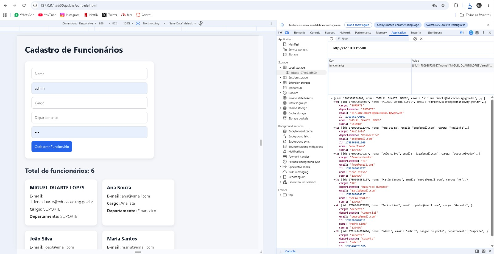

# Cadastro de Funcionários

## Aluno
Nome: Miguel Duarte Lopes

Matrícula: 909425

## Descrição

Aplicação desenvolvida com HTML, CSS e JavaScript para cadastro de funcionários utilizando LocalStorage.

Funcionalidades:

- Cadastro de funcionários
- Listagem dinâmica
- Persistência dos dados
- Contador de funcionários
- Armazenamento no LocalStorage

## Prints

### Aplicação com 5 funcionários

### LocalStorage

### Boas Vindas!!!

